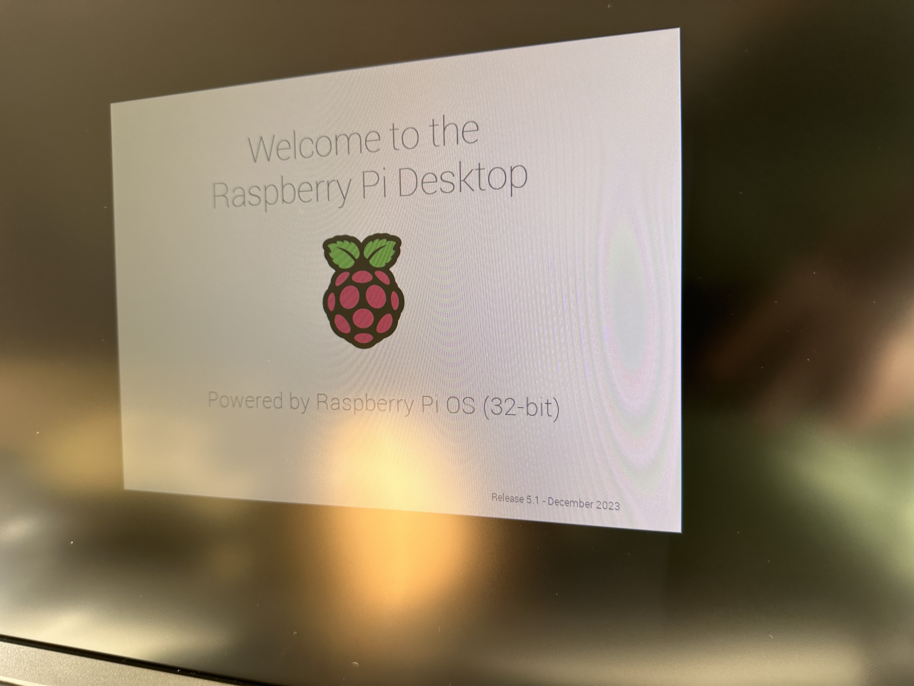
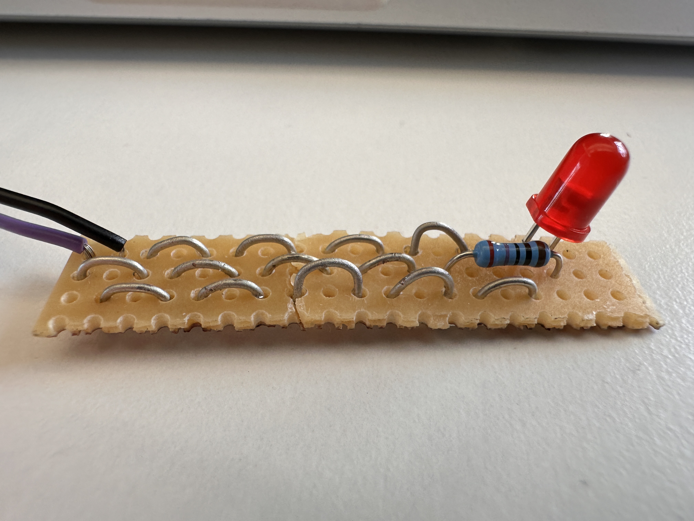
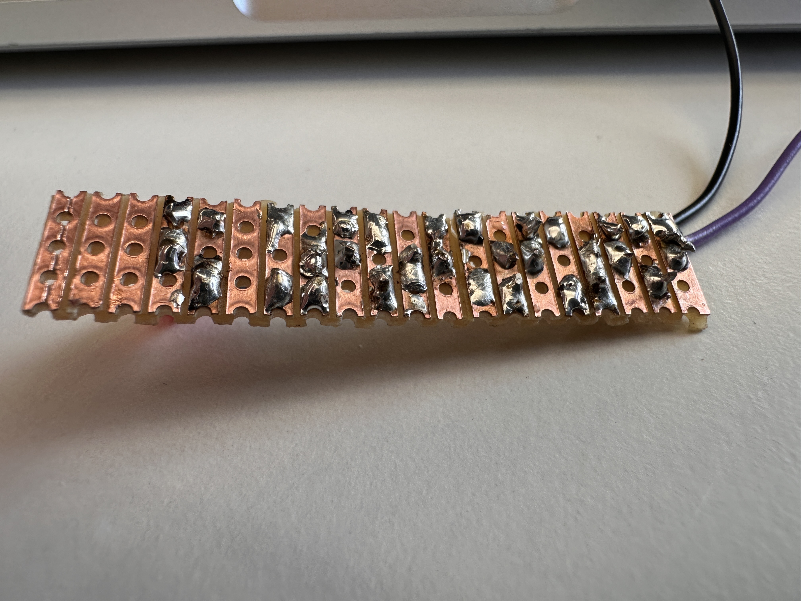
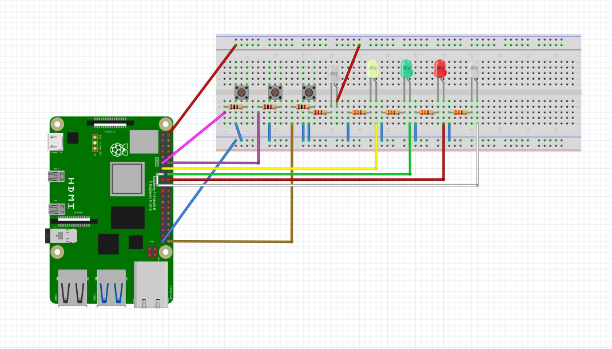
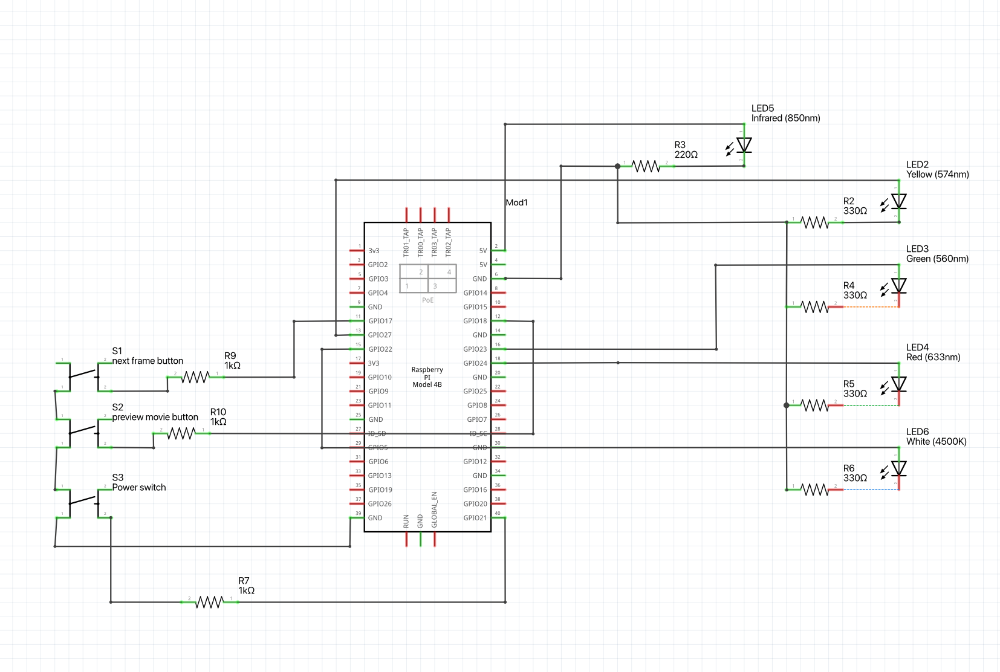
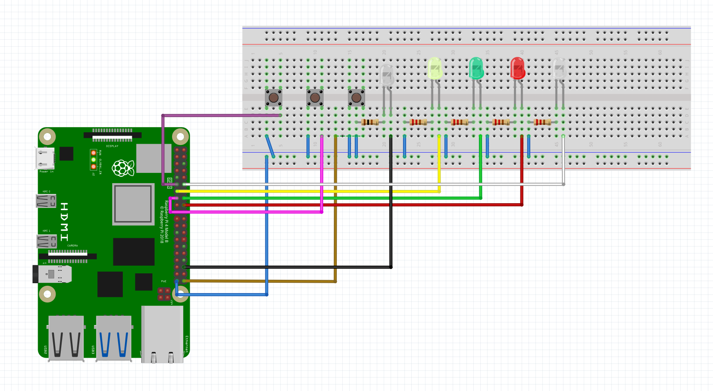
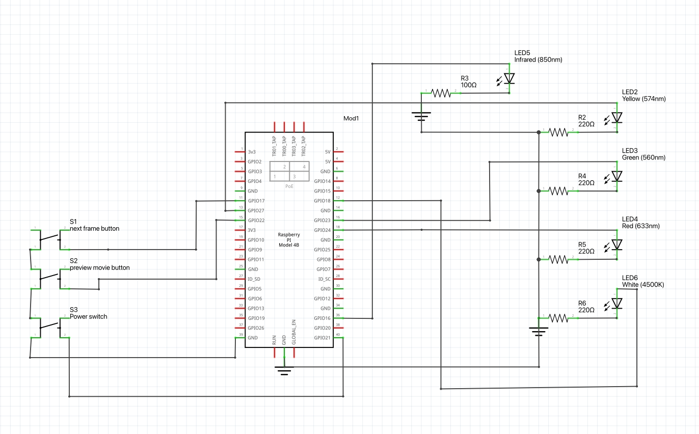
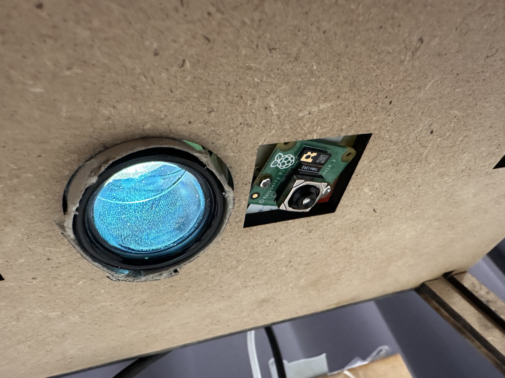
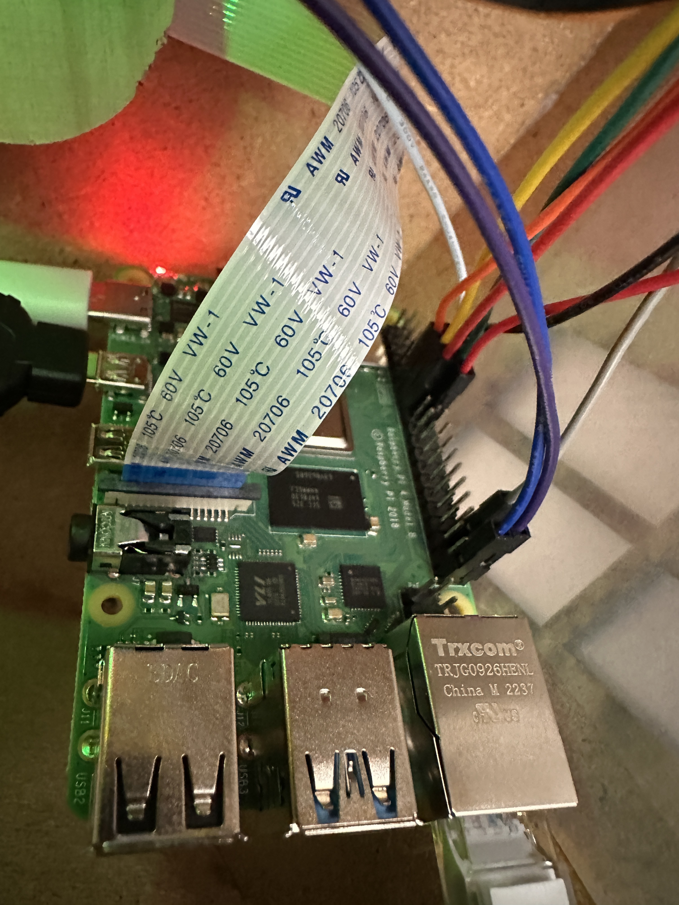

# Electronic

Shortcuts:

1. [2023-12-06](#2023-12-06) Setting up the Rasberry PI

  

###### 2023-12-06

## Setting up the Rasberry PI

I plugged the PI to power and a screen but nothing appeared so I watched [this video](https://www.youtube.com/watch?v=2RHuDKq7ONQ) to flash the sd card. IT WORKED:

 

###### 2023-12-06

## Soldering ex.

  

 

###### 2023-12-21

## controlling the projector

TRY to control it with HDMI with a Python library.

plan B :  
OCTO-ISOLATORs connected to buttons to control the projector buttons with the pi, you activate it as if u were turning on a led.

Don't forget we'll add LEDs to the house !

 

###### 2024-01-09

## To do

- Projector control solution

I noticed there's an IR sensor and found the remote, I could read the remote's signals with the flipper zero so that I can send those signals from the rasberry with a IR led :-)

#### componants list

- <b>Pi</b>

**power switch**

GPIO pins 39 and 40. -> [link](https://www.makeuseof.com/tag/add-power-button-raspberry-pi/#:~:text=Mount%2520a%2520Raspberry%2520Pi%2520Off%2520Switch%2520on%2520the%2520GPIO&text=If%2520you%2520can't%2520get,GPIO%2520pins%252039%2520and%252040.)

**cherry button next frame**

GPIO 17 & GND -> [link](http://razzpisampler.oreilly.com/ch07.html)

**cherry button preview movie**

GPIO 18 & GND

**IR led**

[link](https://projects.raspberrypi.org/en/projects/infrared-bird-box/5) , [link](https://asimuzzaman.com/posts/send-infrared-ir-remote-signal-with-python) (directly to the 5 volt supply of the Raspberry Pi with a 220 ohm resistor inline)

**house led x4?**

[link](https://www.maskaravivek.com/post/controlling-multiple-leds-using-raspberry-pis-gpio-ports/) GPIO 27, 22, 23, 24

###### 2024-01-10

## Fritzing

Needs to be verified by pierre

 

###### 2024-01-13

## Final schematic

Here's what we got :

 

###### 2024-01-16

## Object

