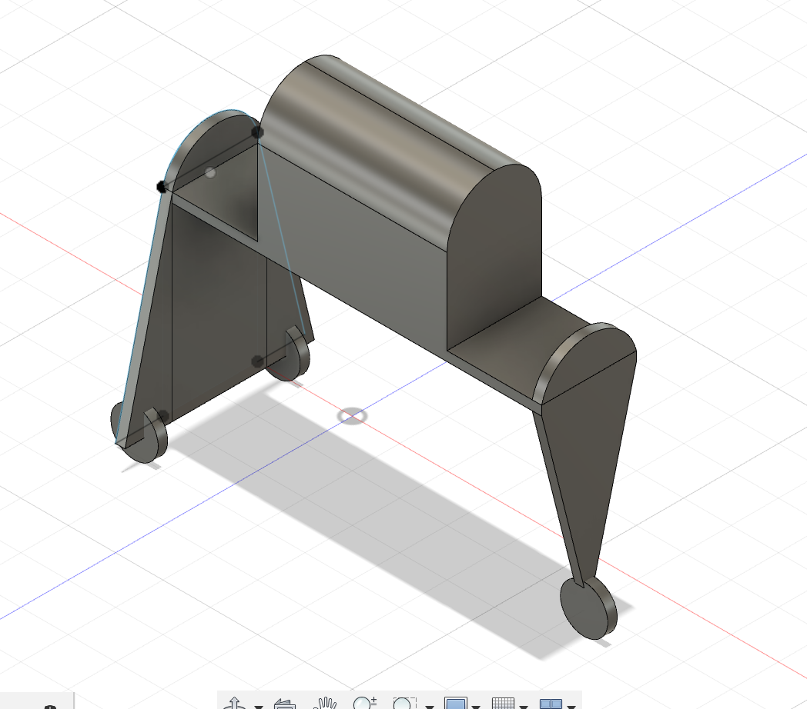
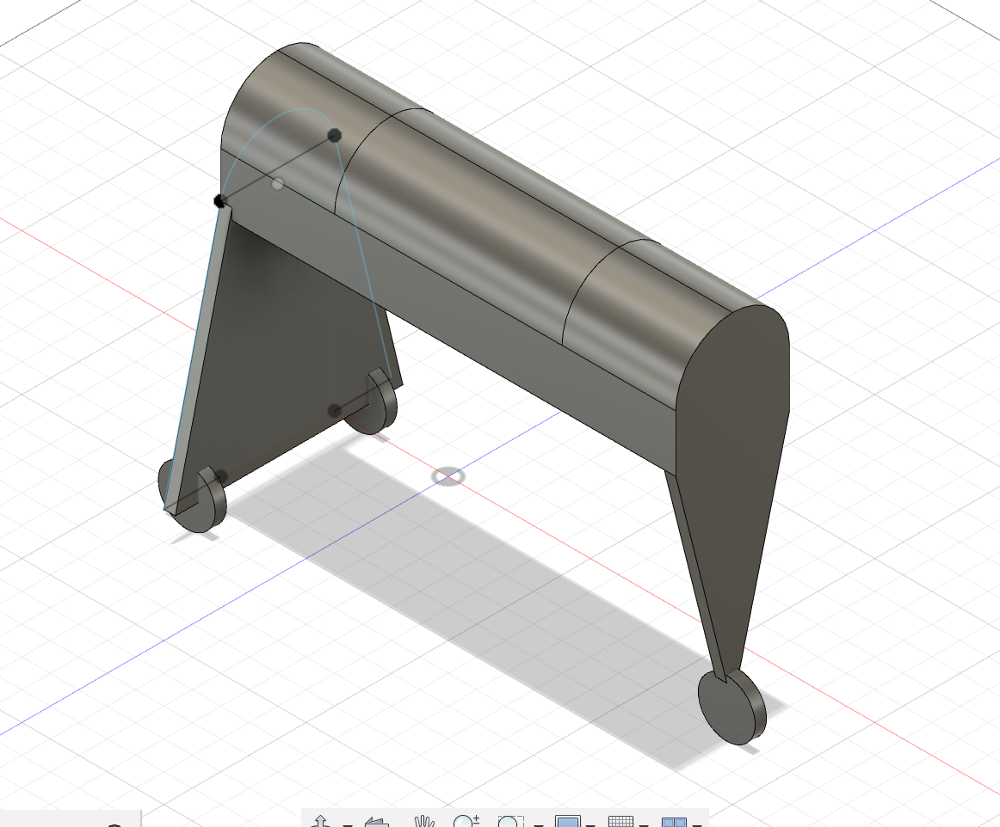

# Object

Shortcuts:

1. [2023-12-05](#2023-12-05) Planning the form

  

###### 2023-12-05
## Planning the form

I tried to measure all of my components to organize how they would fit into a box.

I've gathered that the box should be around 20 x 10 x 10 cm to have space for everything (can probably be smaller though)

I now have to find out how to make it stand about 20 to 30cm above the paper and how the wheels will look.

The initial idea looked like that: 

This box was 20 x 10 x 12 cm and it was 20 cm above the paper, so an appropriate size already.

I had set the width to be above 30 cm so that it could fit the length of an A4 sheet. Just as a first try.

30cm was long enough because we didn't need to fit both hands under. Smaller could work but it might be uncomfortable to draw. Larger would be more comfortable but too bulky I'm afraid.

 

###### 2023-12-06
## form research in Fusion 360

Here's some experiments
    

 

###### 2023-12-19
## form research in Fusion 360

 

 

###### 2023-12-20
## Componants

- Rasberry PI
- battery
- SD card
- mini projector (projects onion skin and acts a display screen)
- PI camera (missing zoom lenses)
- button 1 - next frame (takes pic, moves, projects pic)
- button 2 (plays a video of the saved frames)
- switch on/off
- wheels
- step motor to move wheels
- cervo motor to turn wheels
- motor controller ?
- LEDs if i do the little house design

### Attempts at making the final form

v1

v2

I think I prefer the house, however, I'm afraid the box is not deep enough and will need adjustments. maybe it should be longer too ?

It would need to be made with wood.
Which is warmer, cozier and smells good. I also want to add LEDs and blurry windows so that the house looks like it has lights in.
