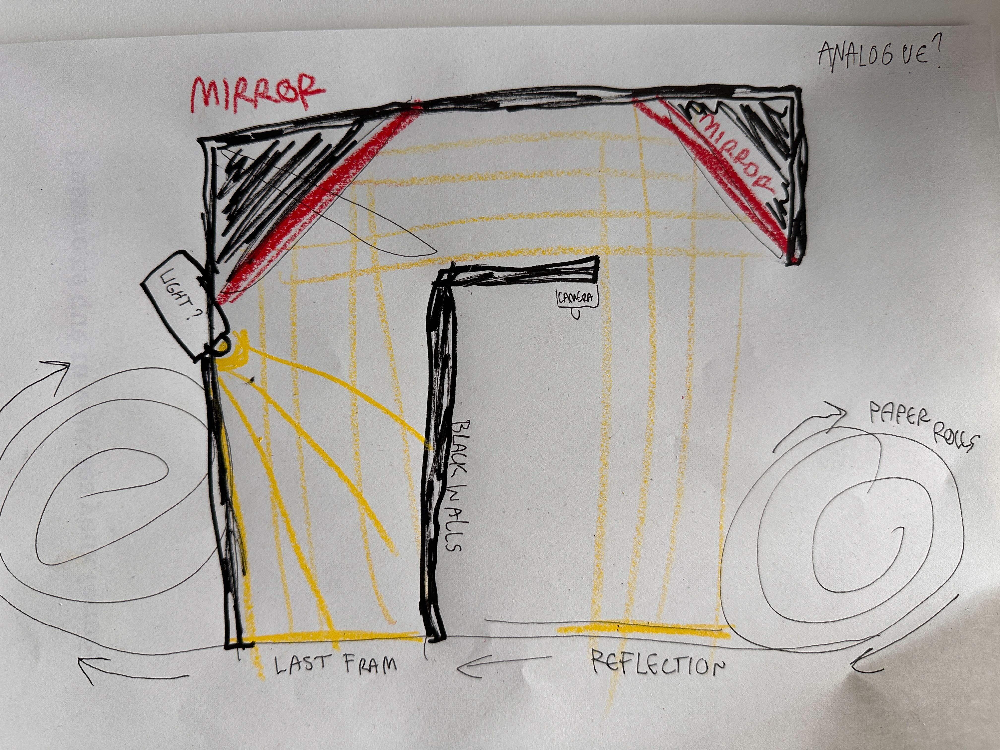

# Process

Shortcuts:
- [2023-10-30](*2023-10-30*) Research 1
- [2023-10-31](*2023-10-31*) Prototype 1
- [2023-11-01](*2023-11-01*) Testing 1
- [2023-11-03](*2023-11-03*) Pitch and key insights
- [2023-11-13](*2023-11-13*) Prototype 2 (fail)
- [2023-11-14](*2023-11-14*) Sketching and prototype number 3

  

*2023-10-16*
to 
*2023-10-26*

Refere to the files on the process folder to view what was made before creating the git.

  

*2023-10-30*
## Animation machine idea

### Interview
On my first interview test, my questions weren't very good but I had an insightful discussion with someone who said they don't draw much but they used to draw to make little animations, and that drawing is exciting because of the posibilities and all the things you can come up with and create.

### On the topic of animation
Following this discussion, I remembered that I was doing silly little animations too. I then dig up an old collections of little animations I had made in that quick, low expectation and high spontaneousity and intuition flow. I realised that for me this is when drawing feels the best, when you convey a story without worring about how you draw, when it happens quick enough that you can almost create the scene in your head in real time, where it doesn't matten if it's stick figures. When it moves it comes alive.

### Ipad animation apps

In an app like "animatic" on the ipad, whereyou have a stylus to draw and the app is bare bone with very little options, it's very easy to be loose and spontaneous if your drawings, since theres a lot of frames to do you want to be very quick and since it goes by fast there is no use in focusing on the details. the less you focus on doing it "well", the more expressive and fun the result will be.
The app is easy to use, you have the most basic and nessesary tools for hand drawn animation:
Onion skin, new frame and export video.

.mp4)

### Resulting path I might go on

I absolutely love those ipad apps but when drawing on a tablet i loose all the sensory joy of traditional drawing tools such as the Caren d'ache products. My thought was that If i could make an app or tool that can provide tools such as Onion skin and "next frame" but phisically to use with traditional tool, I could make hand drawn or paint animation as accessible and as easy as when I use those ipad apps, we could make works as expressive as my digital exaples but with the feeling of physical tools and with the beauty, colours and textures of Caren d'ache tools.

 

### thoughts about the process

How could I redirect field researche that way?
- rewrite interview questions
- make animation cadavre exquis with classmates and take notes
- prototype the paper roll mechanisme of my drawing

Things that the device could be doing:
- roll paper like a "parchemin" to get to the next blank frame automatically
- Projector for onion skin?
- camera to capture frames for onion skin
- the camera could double as quality export material like if you have a light and maybe a wall to block external lights and the fact that the drawing will be directly placed correctly for "prise de vue direct" and it would make the process even more accessible if you have direct export and no post process are needed.

### Paper size

Should probably be a small drawing area, as small drawings are quicker, less focused on details and its easier to loosen up..
small is trasportable
small you can leave on a desk and use anytime

### Goal ?

Remove all friction in the traditional animation workflow to make it more *accesible*, quicker, less scary easier to experient animating with all kind of tools.
ipad-like silly animations but with ~ sensory pleasur ~ and *texture* and ALL THE TOOLS.

### Sketch

### other unrelated ideas:

  

*2023-10-31*
## Creation of the git, and building a cardboard prototype
we had a quick presentation of our process with the classe and then I started building my first animation machine prototype to test the idea of the rolling paper...

I've put a piece of clear plexiglass because I can't really test a projector, but on the iphone there's an app to draw with onion skin using the phone camera, it was made for stopmotion animations and it looks like that:

  

*2023-11-01*
## Testing the prototype

### Person 1 (doesn't draw)

She said it reminds her of the animation app on nintendo DS, which was very simple, didn't have many options and was low stakes.
The toilet paper helped to lower the stakes even more so it was easy for her to relax and draw without pressure.
She really enjoyed it even if she does not normally draw.

### Person 2 (illustrator)

he was excited by the device and loved using it, said he wanted to continue and not stop.
described that he would not normally do animation and that he had no idea that it could be done this way, the process made it a lot more accesible. 
Toilet paper was not ideal as it tears so it's hard to draw on
- Bigger screen would help
- The size is good
Loved the idea of using other mediums like ink.
Made him want to do a lot more animations.
having just to push 1 button to go to next frame makes the process super quick and it makes you want to do more.
- wanted an accessible button like you could just draw with one hand, click with the other, draw again, ect...
(note: he is left handed, the button would need to be movable ?)
said that normally the process for traditional animation is intimidating because you need like a camera or scanner and transparent paper or holes to align the paper but with this machine it felt effortless.

### Person 3 (illustrator)

- Had trouble understanding what needed to be done at first ( maybe i should have an illustrated tutorial somewhere ).
- Panicked a bit when she drew on the table.
- She did say "This machine is incredible!".
Drawing on toilet paper is tidious. 
- She had never animated with traditional drawing tools and she had fun, said it's better than on the tablet. 

### Takeaways
- needs better paper ( im looking for some ticket machine rolls)
- people had fun
- makes traditional animation accessible and makes it a lot less intimidating
- button with haptic ?
- only 2 step, draw and press button. simplicity=good
- paper roll feels a lot less scary than a white page, makes it easier to start without fearing of messing up, also because the last drawing dissapears in the roll.
- small size makes it quicker
- makes people want to animate, and aniimate more
- we just continued the animation after each person so it made a collaborative cadavre exquis

### Final notes of the day
- if i makes it with the same system as the iphone app i could have a bigger screen.
- the object right now is small enough to be portable or to be kept on my desk.
- having a light would make the pictures more homogenous and the camera gives better quality if the lighting is good but it would need to be an area light or ring light and not a spotlight.
- I thought it might be too small to draw comfortably but actually since we only draw with one hand and the other hand would be with the button externally this size is good and those who tried likes the size.
- height seems good too, too hight you wouldnt see the screen and too low you would not be able to use taller paintbruches....
- you canot be super precise but i think that's a good thing because the animation style is more expressive that way

USE " analogue " INSTEAD OF " traditional ".

### Teachers comments
Should be more than just a tool.
but it's good and works great, think of other forms, story telling? could it be a teacher? coach? tutorial but in a creative way? does the roll tell a story? (I would rather the roll stays blank)

### NEXT STEP
Get an A3 page of paper and draw a hundred different animation machines !
(to iterate and find unlikely forms and systems)

 

*2023-11-03*
## Pitch and key insights

### Project description
I'm on a mission to make analogue animation more accessible and enjoyable for everyone, from hobbyists and indie filmmakers to kids. Animation, for me, is the ultimate worry-free way to bring creativity to life. Inspired by user-friendly iPad animation apps, my project aims to bring the simplicity and fun of digital animation to the tangible world. By creating a device that simplifies the animation process, I hope to eliminate the traditional complexities, making it quick and enjoyable. This project is dedicated to utilizing Caran d'Ache tools, providing a wide range of textures and creative possibilities that traditional animation offers.

### PITCH
This project is to build a user-friendly tool that simplifies analogue animation. Inspired by easy-to-use iPad animation apps, I am trying to bring that simplicity to analogue animation. Making animation accessible, quick, and fun for everyone, with the tactile joy of hand-drawn art. The object is dedicated to giving a fun project to do, providing a worry-free way to use the Caran d'Ache tools for minimal friction and maximal accessibility and creativity.

### key insights
I've tried to engage in as many discussions as possible about this subject with anyone I've recently met.
- People who have tried animation had fun drawing in that context, even if they don't normally draw.  
- Any drawings can result in interesting movements, but most people feel the drawings need to be "good," making animation seem inaccessible.  
- Even those who are comfortable with drawing still consider analogue animation inaccessible due to the steps, complications, and time it involves. (iPad animation apps alleviate this, but not everyone enjoys digital drawing, and we don't all have an iPad.)  
- Professional animators are also interested in finding processes that can yield different and interesting results, and any reduction in friction is welcome in any process.  
- Traditional animation courses typically begin with a simple ball bouncing, which is a good way to explain how animation works in a simple, accessible manner, helping people get started.  
- I've encountered frustration when trying to convey to people that drawings don't need to look good and that it's possible to draw without worrying about how it looks. But how can I convey that with my project? How can I help people let go of perfectionism?  
- Children can naturally do this, but it becomes harder as we age, affecting everyone, both regular people and experienced illustrators alike.  
- Sometimes when I show examples of "bad" drawings that are fun, it helps.  
- In my studies of illustration and comics, I've encountered multiple ways in which drawing exercises are used to loosen up and help with letting go of perfectionism. These exercises include drawing with closed eyes, using the non-dominant hand, or applying constraints like designers do to enhance creativity. Constraints mean we can't achieve perfection, so we don't demand good results from ourselves, and we're not paralyzed by expectations. This unleashes creativity.  
- I've also attempted to study procrastination, and the desire to excel seems to paralyze people to the point where they can't even try at all.  
- Another thing that will paralyze anyone is feeling like we're not allowed to fail. In one of my experiments, non-illustrators felt that it was easier to draw on toilet paper (which is difficult to work with) than on normal paper because they felt that it was okay to fail on something that is destined to be thrown away. They have a hard time allowing themselves to waste paper.  
- It is most difficult to allow ourselves to fail or waste resources, like paper or nice pens and art tools such as Caran d'Ache products.  
- To be creative, one must be allowed to fail, destroy, and waste resources.  
- In animation, you HAVE to waste paper, so maybe that's why some people manage to draw more freely when drawing on paper rolls.  
- The final project needs to be more than just a tool.   
- For optimal use, one hand should have access to "next frame" button while the other hand is drawing.

 

*2023-11-13*
## Prototype 2
The tale of a failed experiment ._.

Jokes aside, I enjoyed building this, and I love the form and design. However, it doesn't work because physics don't operate that way, and I'm neither a scientist nor an engineer.

 

*2023-11-14*
## Sketching and prototype number 3
Idea drawings

Projector on paper roll iterations

I then realised that instead of the paper rolling, the device could be moving on a large area of paper so that there is both an animation output and an analogue cooperative artwork output.
Then the project becoms a mix of 2 different things, animation and cooperative doodling...

The thought is that for an exhibition context it would be more interesting and entertaining for the drawings to output to something phisical as well as digital.

Form and movement iterations

A rail mechanisme like on drawing machines would work, but having an RC car type of device driving around would be infinitely more entertaining. Of course it would be automatic, ai driven.

Phyisical test with a projector

How it would work:

What the output could look like after many users used the device on the same canvas...
The canvas would be big like 1m x 1m on a table.

But perhaps it would make more sense on the floor? Then it could be even bigger...
But i'm not sure. I'm wondering if this is too much and maybe it was better as a simple tool.

At least the projector part works, mine had to be placed far from the canvas but i've been told that some projectors are designed for shorter ranges.

I used my phone here but i would like it to have its own device that does camera + driving algorithm for the wheels + streaming to projector + screen for buttons and anomation preview ?